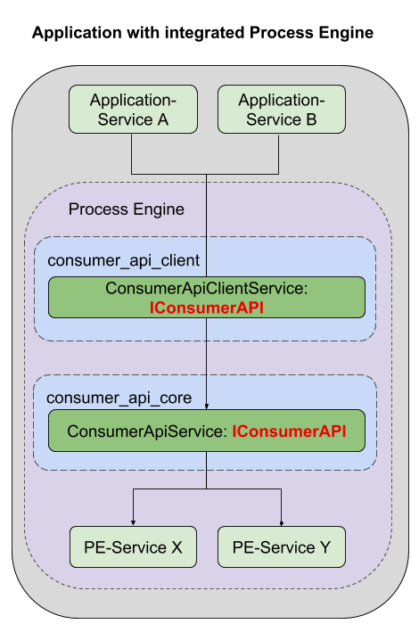

# Access internal ProcessEngine with Consumer API

This sample demonstrates how to use the `ConsumerApiClientService` to access
a ProcessEngine, which is contained directly within the application.

Note that this example relies completely on IoC, as this is one of the main
architectural principles used to develop the ProcessEngine.

That is also the reason why there won't be a sample for using an internal
process engine without using IoC, as this is would be completely impractical.

## Requirements

This sample has the following minimal requirements:
- NodeJS v8.9.x
- Globally installed `gulp`
- A running postgres server

If you do not have `gulp` installed, you can do so by using the
`npm install -g gulp` command.

## Setup

Run the following commands in sequence:
- `npm install` or
- `npm install --no-package-lock` if you do not want npm to create a lockfile
- `npm run build`

The sample uses SQLite as its datastorage. The database file will be placed
directly into the sample folder and bears the name `processengine.sqlite`.

There is no need to configure anything.

## Executing the sample

You can use `npm start` to run the sample.

## Sample Components

This sample consists of the following components:
- `config`: Contains a full configuration for a ProcessEngine
  and the consumer api
- `bpmn`: Contains a sample process that will be used by the sample application
- `ioc_module.js`: This will register the sample process at the IoC container.
  It also creates a custom registration for the `ConsumerApiClientService`,
  enabling it to access the ProcessEngine contained within this sample
- `src`: Contains the sample project. It has two files:
  - `setup.ts`: Contains functions necessary for handling all IoC related
    operations, aswell as handling bootstrapper startup and shutdown
  - `program.ts`: This contains the actual sample project.
    When running `npm start`, this is the program that gets executed

## Step By Step

The sample code has been commented extensively, so you can follow each
step of the program.

In short, the sample will perform the following actions:
- Initialize an IoC container that contains a complete setup for the
  ProcessEngine and the consumer api
  - The `ConsumerApiClientService` will be given an accessor for accessing the
    ProcessEngine included in this sample application
- Create fixtures for a sample user
  - The sample user will be removed when the program has finished
- Use the `ConsumerApiClientService` to
  - start the sample process
  - retrieve the waiting user task for the sample process when it is reached
  - finish the user task with a given payload
  - retrieve and log the process instance result
