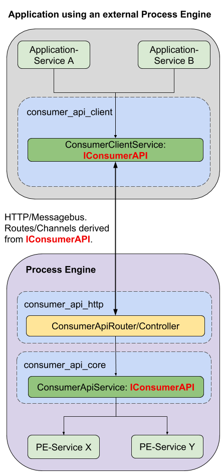

# Access external ProcessEngine with Consumer API

This sample demonstrates how to use the `ConsumerApiClientService` to access
a ProcessEngine, which is contained directly within the application.

## Sample Components

This sample consists of three individual applications:
- **Server**: Contains a process engine and an endpoint for the consumer api.
  Use this application to provide an endpoint for your clients
- **Clients**: There are two different client applications that you can use to
  access the server application:
  - One basic client that manually creates an instance of the
  `ConsumerApiClientService` and a `CustomerContext`
  - One client that makes full use of addict-ioc, including its container

Both clients will perform the same sample script.
The only difference is in how they are set up.

## Requirements

All applications have the following minimal requirements:
- NodeJS v8.9.x
- Globally installed `gulp` 
- A running postgres server (Server only)

If you do not have `gulp` installed, you can do so by using the
`npm install -g gulp` command.

## Setup

You must run the following commands in the server and client applications:
- `npm install`
- `npm run build`

Also make sure that the connection settings to your postgres instance
are accurate and that the database exists!

You can find the postgres config file at the following location
in the server application:
`config/demo/data_sources/postgres.json`.

Note:
The datatables required by the ProcessEngine will be created automatically
at startup.

## Executing the sample

You can use `npm start` to start each application.

Note that the server will only start up and then wait for connections.
The clients will run their sample script and then shutdown.

To shutdown the server, you can use the usual `ctrl+c` command.

## Step By Step

The sample codes have been commented extensively, so you can follow each
step of the program.

The server handles the following operations:
- Accept incoming HTTP Requests from the clients
- Create a consumer context for a client, by use of the `/iam/login` route
- Use the consumer api to perform each operation made by the client:
  - start the sample process
  - retrieve waiting user tasks
  - finish a user task with a given payload
  - retrieve a process instance result

Each client will perform the following actions against the server:
- Create an instance for the `ConsumerApiClientService`
  - The client will be given an accessor for accessing the server's
    ProcessEngine
- Use the `ConsumerApiClientService` to
  - start the sample process
  - retrieve the waiting user task for the sample process when it is reached
  - finish the user task with a given payload
  - retrieve and log the process instance result
